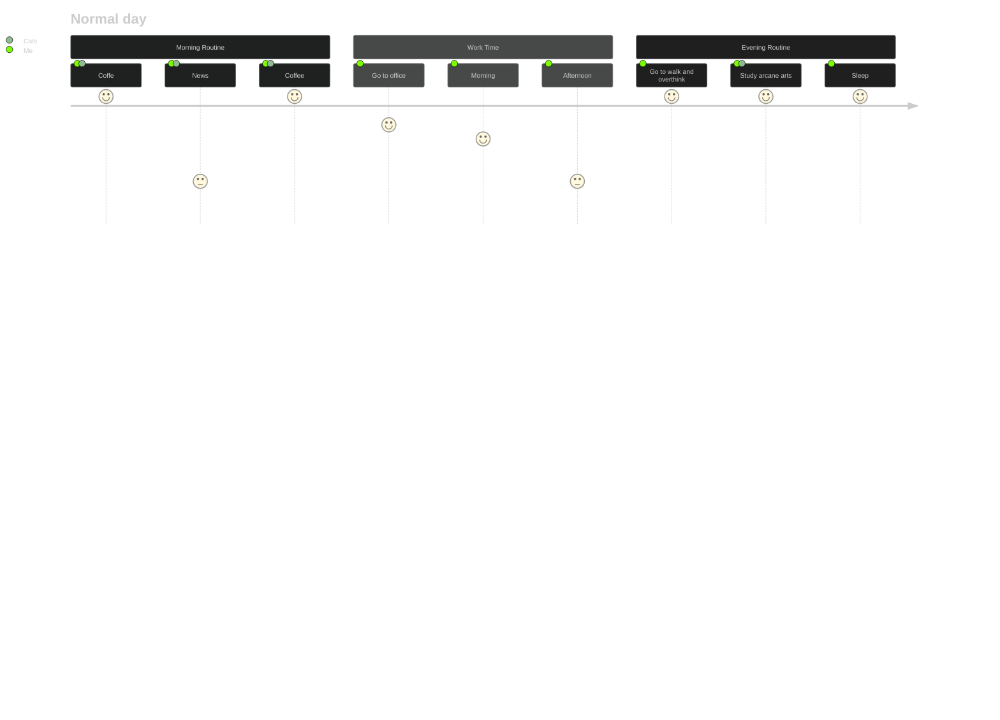

<!--

-->

- 🔭 Working on web penetration testing and basic secure code review.
- 🌱 Learning Windows internals basics and low-level C++.
- 🤔 Looking for mentorship on advanced topics such as OPSEC considerations, evasion fundamentals, anti-forensics concepts, and C2 architecture principles.

 

 

<!--
**axel-delnegro/axel-delnegro** is a ✨ _special_ ✨ repository because its `README.md` (this file) appears on your GitHub profile.

Here are some ideas to get you started:

- 🔭 I’m currently working on ...
- 🌱 I’m currently learning ...
- 👯 I’m looking to collaborate on ...
- 🤔 I’m looking for help with ...
- 💬 Ask me about ...
- 📫 How to reach me: ...
- 😄 Pronouns: ...
- ⚡ Fun fact: ...
-->
