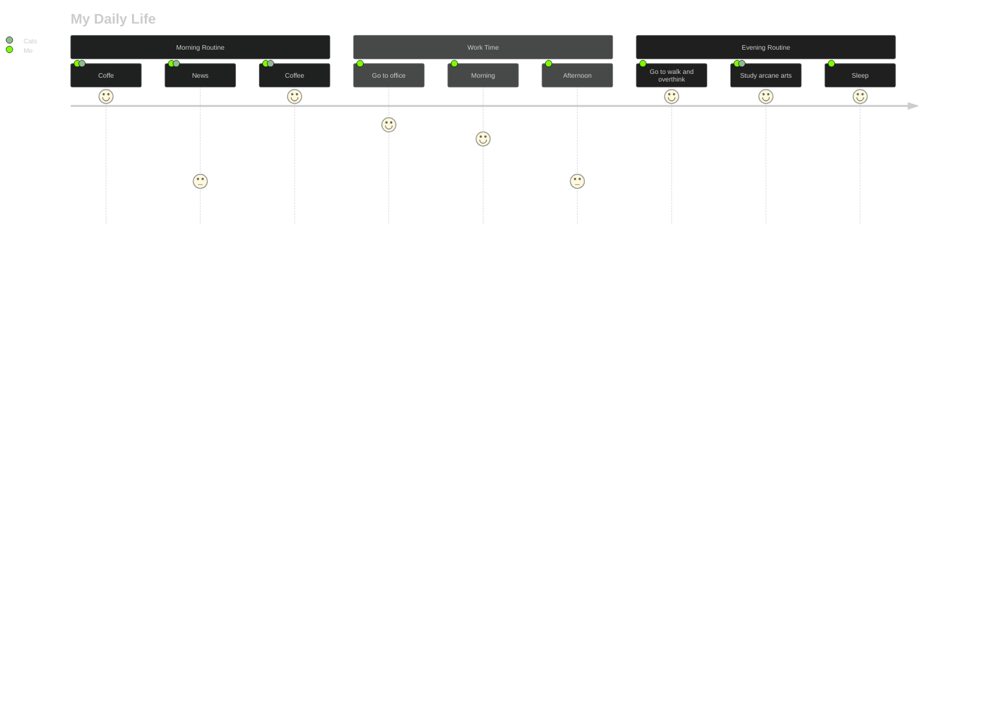

### 👤 whoami
Cybersecurity enthusiast, PT/Red Teamer. Im currently work on offensive security with technical and practical approach.

### 💼 what im doing
In my spare time I try to develop custom tools for Red Team, post-exploitation and automation. I also trying to do exploit development, reverse engineering and threat simulation.

### 🌱 I’m currently learning 
- Low-level C++ to develop loaders, shellcode wrappers, reflective DLLs, etc.
- Windows internals (API, PE, memory management, syscall)
- Advanced techniques to bypass EDR/sandbox and persistence.
- Architecture and design of modular and OPSEC-safe C2 frameworks.

### general
- 👯 I’m looking to collaborate on red teaming frameworks, adversary simulation, and custom implants and phishing simulations.
- 🤔 I’m looking for help with advanced anti-forensics and hypervisor-level evasion techniques.

---

  

---

```mermaid
---
config:
  theme: neo-dark
---
journey
  title My Daily Life
  section Morning Routine
    Coffe: 9: Me, Cats
    News: 3: Me, Cats
    Coffee: 9: Me, Cats
  section Work Time
    Go to office: 7: Me
    Morning: 6: Me
    Afternoon: 3: Me
  section Evening Routine
    Go to walk and overthink: 9: Me
    Study arcane arts: 9: Me, Cats
    Sleep: 9 :Me
```

<!--
**axel-delnegro/axel-delnegro** is a ✨ _special_ ✨ repository because its `README.md` (this file) appears on your GitHub profile.

Here are some ideas to get you started:

- 🔭 I’m currently working on ...
- 🌱 I’m currently learning ...
- 👯 I’m looking to collaborate on ...
- 🤔 I’m looking for help with ...
- 💬 Ask me about ...
- 📫 How to reach me: ...
- 😄 Pronouns: ...
- ⚡ Fun fact: ...
-->
